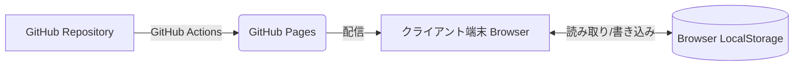

# 📐 ダイエットダッシュボード システム設計書 (Architecture Blueprint)

本ドキュメントは、ダイエットダッシュボードの全体的なシステム構成、採用技術、データ構造、およびコンポーネント構成を定義する設計図です。

---

## 1. システム概要 (System Overview)
* **目的**: ユーザーが毎日の体重（および将来的な指標）を記録し、理想的なペースとのギャップを視覚的に把握することで、モチベーションを極大化する。
* **運用形態**: インストール不要の完全クライアントサイドWebアプリケーション（SPA: Single Page Application）。
* **ホスティング**: GitHub Pages を用いた静的ファイルの配信。

---

## 2. アーキテクチャ (Architecture)

本システムは、バックエンド（サーバー側のデータベース等）を持たない **Local-First (ローカルファースト)** なアーキテクチャを採用しています。

### 採用技術スタック
* **フロントエンド・フレームワーク**: React 18
* **ビルドツール**: Vite
* **スタイリング**: Vanilla CSS (CSS変数を用いたテーマ管理, Glassmorphism)
* **グラフ描画**: Recharts
* **アイコン**: lucide-react
* **CI/CD**: GitHub Actions (`deploy.yml`)

---

## 3. データモデル (Data Model)

すべてのユーザーデータは、ブラウザに標準搭載されている `LocalStorage` を用いて、ユーザー自身の端末内にのみ保存されます。

### ストアキー: `diet_records`
**型 (Type)**: `Array<Object>`

| プロパティ名 | 型 | 説明 | 例 |
| :--- | :--- | :--- | :--- |
| `date` | `String` | 記録日（YYYY-MM-DD形式） | `"2026-04-16"` |
| `weight` | `Number` | 記録時の体重 (kg) | `82.2` |

*将来的な拡張予定*: カロリー赤字額や体脂肪率などのプロパティを追加予定。

---

## 4. コンポーネントツリー (Component Structure)

現在の `App.jsx` 内部の論理的なUI構成は以下の通りです。

1. **Header (ヘッダー)**
   * アプリタイトル、モチベーションフレーズ
2. **KPI Board (重要指標パネル)**
   * 現在の体重・総減量幅
   * 目標までの残りkg
   * 本日の目標ライン（オンスケジュール判定）
   * 残り日数
3. **Progress Chart (進捗グラフレイヤー)**
   * `Recharts` を用いた、平均目標ライン(紫)と実績ライン(水色)のオーバーレイ表示。
4. **Input Section (入力フォーム)**
   * 日付と体重を入力し、LocalStorageの配列へ更新をかける。
   * 新しい体重が前回より低かった場合、**ConfettiOverlay (お祝いアニメーション)** をトリガー。
5. **History List (最近の履歴)**
   * 過去の記録を降順（新しい順）で5件表示。それぞれに削除(Trash)関数をバインド。

---

## 5. 将来の拡張構想 (Future Roadmap)

バックログに基づき、以下へのアーキテクチャ拡張を視野に入れています。
1. **PWA (Progressive Web App) 化**: `manifest.json` と Service Worker を導入し、AndroidやiOSのホーム画面にネイティブアプリのようにインストール可能にする。
2. **バックグラウンドAPI拡張**: 利用ログやプッシュ通知を実現するため、Firebase等の軽量BaaSとの段階的連携検討。
3. **権限管理 (Access Control)**: データの改ざん防止のため、特定のパスワードや認証（Google Auth等）を知るユーザーのみが記録を更新・削除できる仕組みの導入。

---

## 6. プロジェクト運用管理 (Project Management)

持続可能で安全な機能拡張を実現するため、以下のルールに基づいて開発を進行します。

### バージョン管理 (Semantic Versioning)
> [!NOTE]
> **用語解説: セマンティック・バージョニング (Semantic Versioning)**
> ソフトウェアのバージョンを「メジャー.マイナー.パッチ」（例：`v1.2.3`）の3つの数字で表す世界標準ルール。左の数字（メジャー）が変わるほど、システム全体の「破壊的変更」や「大刷新」を意味します。

*   `v[メジャー].[マイナー].[パッチ]` 形式を採用します。
*   現状を `v1.0.0` とし、大幅なアーキテクチャ変更（クラウド化など）でメジャーバージョンを更新、機能追加でマイナーバージョンを更新します。

### 開発フロー (GitHub Flow)
> [!NOTE]
> **用語解説: GitHub Flow / ブランチ / マージ**
> *   **GitHub Flow**: 最もポピュラーでシンプルなチーム開発ルールの1つ。本番用と作業用を常に分けるのが特徴です。
> *   **ブランチ (Branch)**: 歴史を「枝分かれ」させ、本番（本流）に影響を与えずに別の作業を行う機能のこと。
> *   **マージ (Merge)**: 枝分かれ（ブランチ）して作業した内容を、本番環境に「合流（統合）」させる操作のこと。

*   **main ブランチ**: 常にデプロイ可能（本番でトラブルなく動作する）で安定した状態を保ちます。
*   **feature ブランチ**: `feature/#課題ID-内容` の命名規則で機能追加用の作業ブランチを作成し、動作・表示の確認完了後にmainへマージします。

### 意思決定の記録 (ADR: Architecture Decision Records)
> [!NOTE]
> **用語解説: ADR (アーキテクチャ・ディシジョン・レコード)**
> システム開発における「重要な技術的決断」と「その理由・経緯」を残す短い文書のこと。「なぜ別のA案ではなくB案を選んだのか」を未来の自分やチームメンバーに共有するために用います。

*   アーキテクチャに関する重要な決定や検討の経緯は、`docs/decisions/` ディレクトリにMarkdown形式の連番（例：`001_storage_and_auth.md`）で記録します。

---
## 変更履歴 (Changelog)
* **2026-04-16**: 初版作成（システムアーキテクチャ定義）
