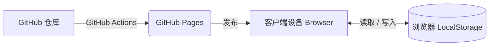

# 📐 减肥仪表板 系统设计书（Architecture Blueprint）

本文档用于定义减肥仪表板的整体系统结构、采用技术、数据结构以及组件构成，是该系统的设计蓝图。

---

## 1. 系统概述（System Overview）

* **目标**：让用户记录每日体重（以及未来可扩展的其他指标），并通过可视化方式直观了解自己与理想减重进度之间的差距，从而最大化提升持续减肥的动力。
* **运行形式**：无需安装的纯客户端 Web 应用（SPA：Single Page Application，单页应用）。
* **托管方式**：通过 GitHub Pages 提供静态文件部署与访问。

---

## 2. 架构（Architecture）

本系统采用**Local-First（本地优先）**架构，不依赖后端（例如服务器数据库等）。

### 采用的技术栈

* **前端框架**：React 18
* **构建工具**：Vite
* **样式方案**：Vanilla CSS（使用 CSS 变量进行主题管理，采用 Glassmorphism 玻璃拟态风格）
* **图表绘制**：Recharts
* **图标库**：lucide-react
* **CI/CD**：GitHub Actions（`deploy.yml`）

---

## 3. 数据模型（Data Model）

所有用户数据都通过浏览器原生提供的 `LocalStorage` 保存，仅存储在用户自己的设备中。

### 存储键：`diet_records`

**类型（Type）**：`Array<Object>`

| 属性名 | 类型 | 说明 | 示例 |
| :--- | :--- | :--- | :--- |
| `date` | `String` | 记录日期（YYYY-MM-DD 格式） | `"2026-04-16"` |
| `weight` | `Number` | 记录时的体重（kg） | `82.2` |

*未来扩展计划*：将增加如热量赤字、体脂率等属性。

---

## 4. 组件树（Component Structure）

当前 `App.jsx` 中逻辑上的 UI 结构如下：

1. **Header（页头）**
   * 应用标题、激励文案

2. **KPI Board（关键指标面板）**
   * 当前体重 / 累计减重幅度
   * 距离目标还剩多少 kg
   * 今日目标线（是否按计划推进）
   * 剩余天数

3. **Progress Chart（进度图层）**
   * 使用 `Recharts` 绘制平均目标线（紫色）与实际记录线（浅蓝色）的叠加图表。

4. **Input Section（输入表单）**
   * 输入日期与体重，并更新到 LocalStorage 中的数组。
   * 如果新体重低于上一次记录，则触发 **ConfettiOverlay（庆祝动画）**。

5. **History List（最近记录）**
   * 按时间倒序（最新优先）显示最近 5 条记录，并为每条记录绑定删除（Trash）功能。

---

## 5. 未来扩展规划（Future Roadmap）

基于当前待办事项，后续架构将考虑扩展至以下方向：

1. **PWA（Progressive Web App）化**
   * 引入 `manifest.json` 与 Service Worker，使应用可像原生 App 一样安装到 Android 或 iOS 的主屏幕。

2. **后台 API 扩展**
   * 为实现使用日志统计、推送通知等能力，逐步评估接入 Firebase 等轻量级 BaaS 服务。

3. **权限管理（Access Control）**
   * 为防止数据被篡改，将考虑引入密码保护或认证机制（如 Google Auth 等），仅允许特定用户更新或删除记录。

---

## 6. 项目运维与管理（Project Management）

为了实现可持续且安全的功能扩展，开发将按照以下规则推进。

### 版本管理（Semantic Versioning）

> [!NOTE]
> **术语说明：语义化版本（Semantic Versioning）**
> 是一种国际通用的软件版本号规范，使用“主版本号.次版本号.修订号”（例如：`v1.2.3`）三段数字表示版本。越靠左的数字变化越大，通常意味着系统出现了较大改动，甚至是不兼容的破坏性更新。

* 采用 `v[主版本].[次版本].[修订版本]` 的格式。
* 当前版本定义为 `v1.0.0`；当出现重大架构变更（例如迁移到云端）时升级主版本号，新增功能时升级次版本号。

### 开发流程（GitHub Flow）

> [!NOTE]
> **术语说明：GitHub Flow / 分支 / 合并**
>
> * **GitHub Flow**：一种最常见且简洁的团队开发流程，其核心特点是始终将生产环境与开发工作区分开来。
> * **分支（Branch）**：即让代码历史“分叉”，从而可以在不影响主线（正式版本）的情况下进行独立开发。
> * **合并（Merge）**：将分支中完成的开发内容重新整合回主线的操作。

* **main 分支**：必须始终保持可部署、稳定且可在生产环境正常运行的状态。
* **feature 分支**：采用 `feature/#课题ID-内容` 的命名规则创建功能开发分支，在完成功能、确认展示与行为无误后再合并回 `main`。

### 决策记录（ADR：Architecture Decision Records）

> [!NOTE]
> **术语说明：ADR（架构决策记录）**
> 是用于记录系统开发过程中“重要技术决策”及其“原因与背景”的简短文档。它的作用是帮助未来的自己或团队成员理解：为什么最终选择了 B 方案，而不是 A 方案。

* 与架构相关的重要决策及讨论过程，统一以 Markdown 形式记录在 `docs/decisions/` 目录下，并采用连续编号命名（例如：`001_storage_and_auth.md`）。

---

## 变更记录（Changelog）

* **2026-04-16**：创建初版（系统架构定义）
