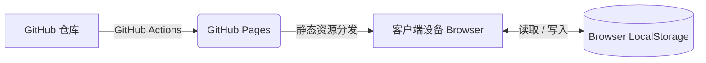

# 📐 减肥仪表板系统设计说明书（Architecture Blueprint）

本文档用于定义“减肥仪表板”系统的总体架构、技术选型、数据模型及组件结构，作为系统设计与后续演进的基础性技术文档。

---

## 1. 系统概述（System Overview）

### 1.1 建设目标

本系统旨在帮助用户持续记录每日体重数据（以及未来可能扩展的其他健康指标），并通过可视化方式呈现当前进度与理想减重节奏之间的差异，从而提升用户对减肥过程的感知能力与持续执行动力。

### 1.2 运行形态

本系统为**无需安装的纯客户端 Web 应用**，采用 **SPA（Single Page Application，单页应用）** 形式运行。

### 1.3 部署方式

系统通过 **GitHub Pages** 提供静态资源托管与访问服务，无需独立服务器环境。

---

## 2. 系统架构（Architecture）

本系统采用**Local-First（本地优先）**架构设计，不依赖传统后端服务（如应用服务器、数据库等）。所有业务逻辑在客户端执行，用户数据仅保存在本地浏览器环境中。



### 2.1 架构说明

系统的发布与运行流程如下：

1. 源代码托管于 GitHub Repository。
2. 通过 GitHub Actions 自动执行构建与部署流程。
3. 构建产物发布至 GitHub Pages。
4. 用户通过浏览器访问应用，前端直接在本地执行。
5. 用户产生的数据通过浏览器 `LocalStorage` 持久化存储于本地设备。

### 2.2 技术栈选型

| 类别 | 技术 | 说明 |
| :--- | :--- | :--- |
| 前端框架 | React 18 | 用于构建组件化单页应用 |
| 构建工具 | Vite | 提供快速开发与高效构建能力 |
| 样式方案 | Vanilla CSS | 使用原生 CSS 实现样式控制，并通过 CSS 变量进行主题管理 |
| 视觉风格 | Glassmorphism | 采用玻璃拟态设计语言提升界面表现力 |
| 图表库 | Recharts | 用于绘制体重变化趋势及目标对比图表 |
| 图标库 | lucide-react | 提供统一风格的矢量图标组件 |
| 持续集成/部署 | GitHub Actions | 基于 `deploy.yml` 自动化执行构建与发布 |

---

## 3. 数据模型（Data Model）

本系统不引入远程数据库。所有用户数据均通过浏览器原生提供的 `LocalStorage` 进行持久化保存，且仅存储于用户当前设备中。

### 3.1 存储键定义

* **存储键（Storage Key）**：`diet_records`
* **数据类型（Type）**：`Array<Object>`

### 3.2 数据结构定义

| 属性名 | 类型 | 说明 | 示例 |
| :--- | :--- | :--- | :--- |
| `date` | `String` | 记录日期，格式为 `YYYY-MM-DD` | `"2026-04-16"` |
| `weight` | `Number` | 对应日期的体重值，单位为千克（kg） | `82.2` |

### 3.3 示例数据

```json
[
  {
    "date": "2026-04-15",
    "weight": 82.8
  },
  {
    "date": "2026-04-16",
    "weight": 82.2
  }
]
```

### 3.4 扩展预留

后续可在现有数据结构基础上扩展以下字段，以支持更丰富的健康管理能力：

* 热量赤字（Calorie Deficit）
* 体脂率（Body Fat Percentage）
* 腰围、BMI 等身体指标
* 备注信息（如饮食、运动、状态说明）

---

## 4. 组件结构（Component Structure）

当前 `App.jsx` 中的逻辑 UI 结构如下所示。该结构反映了当前应用的主要功能分区及组件职责。

### 4.1 Header（页头区域）

**职责：**

* 展示应用标题
* 展示激励性文案或状态提示信息

### 4.2 KPI Board（关键指标面板）

**职责：**

* 展示当前体重及累计减重量
* 展示距离目标体重的剩余差值
* 展示当日目标线及是否按计划推进
* 展示距离阶段目标或截止日期的剩余天数

### 4.3 Progress Chart（进度图表层）

**职责：**

* 基于 `Recharts` 绘制体重趋势图
* 同时展示：
  * **平均目标线**（紫色）
  * **实际记录线**（浅蓝色）
* 通过叠加展示帮助用户快速识别实际进展与目标进度之间的偏差

### 4.4 Input Section（数据录入区域）

**职责：**

* 提供日期与体重输入能力
* 将输入结果写入 `LocalStorage` 中的记录数组
* 当新录入体重低于上一条记录时，触发 **ConfettiOverlay（庆祝动画）** 以增强正向反馈

### 4.5 History List（历史记录列表）

**职责：**

* 按时间倒序展示最近 5 条记录
* 每条记录支持删除操作
* 删除动作绑定对应的 `Trash` 图标交互

---

## 5. 未来演进规划（Future Roadmap）

基于当前产品方向与待办事项，系统后续可沿以下方向逐步演进。

### 5.1 PWA 化

通过引入 `manifest.json` 与 Service Worker，将当前 Web 应用升级为 **PWA（Progressive Web App）**，实现以下能力：

* 支持添加至 Android / iOS 主屏幕
* 提升离线访问能力
* 提供更接近原生应用的使用体验

### 5.2 后台能力扩展

为支持更复杂的业务场景，后续可逐步接入轻量级后端能力（如 Firebase 等 BaaS 服务），用于实现：

* 使用行为日志统计
* 多设备数据同步
* 推送通知
* 云端备份与恢复

### 5.3 权限控制与数据保护

为提升数据安全性并避免非授权操作，后续可考虑引入认证或访问控制机制，例如：

* 应用访问密码
* Google 账号登录
* 受限操作确认机制

目标是确保仅授权用户能够执行记录新增、修改与删除操作。

---

## 6. 项目治理与研发规范（Project Management）

为保证系统能够在后续迭代中持续保持稳定性、可维护性与可扩展性，项目开发遵循以下管理规范。

### 6.1 版本管理（Semantic Versioning）

> [!NOTE]
> **术语说明：语义化版本（Semantic Versioning）**  
> 语义化版本是一种国际通用的软件版本编号规范，通常采用“主版本号.次版本号.修订号”的三段式格式（例如：`v1.2.3`）。  
> 其中：
>
> * **主版本号（Major）**：表示存在不兼容的重大变更
> * **次版本号（Minor）**：表示向后兼容的功能新增
> * **修订号（Patch）**：表示向后兼容的问题修复

#### 版本规则

* 统一采用 `v[主版本].[次版本].[修订版本]` 格式。
* 当前系统版本定义为 `v1.0.0`。
* 当发生重大架构变更（例如由本地模式演进为云端架构）时，递增主版本号。
* 当新增功能但不破坏兼容性时，递增次版本号。
* 当进行缺陷修复或细节优化时，递增修订版本号。

---

### 6.2 开发流程（GitHub Flow）

> [!NOTE]
> **术语说明：GitHub Flow / 分支 / 合并**  
>
> * **GitHub Flow**：一种简洁且广泛采用的协作开发流程，强调主干始终保持可发布状态。  
> * **分支（Branch）**：用于在不影响主线代码的前提下进行独立开发。  
> * **合并（Merge）**：将分支中的开发成果整合回主干的操作。

#### 分支策略

* **main 分支**  
  作为生产主干，必须始终保持可部署、可运行、稳定的状态。

* **feature 分支**  
  所有新增功能或修改任务均应从 `main` 拉取独立分支进行开发，命名规则如下：

```text
feature/#课题ID-内容
```

示例：

```text
feature/#12-add-weight-history-delete
```

#### 合并要求

功能开发完成后，需至少完成以下验证后方可合并至 `main`：

* 核心功能运行正常
* 页面显示无明显异常
* 交互行为符合预期
* 不影响既有功能稳定性

---

### 6.3 架构决策记录（ADR: Architecture Decision Records）

> [!NOTE]
> **术语说明：ADR（Architecture Decision Record，架构决策记录）**  
> ADR 是用于记录重要技术决策及其背景、备选方案、取舍理由的轻量级文档。其核心目标是保留“为什么这样设计”的上下文，以便未来维护者或团队成员理解历史决策依据。

#### 记录规范

* 所有与系统架构相关的重要决策均应进行文档化记录。
* 文档统一存放于 `docs/decisions/` 目录。
* 文件命名采用递增编号方式，例如：

```text
001_storage_and_auth.md
002_pwa_strategy.md
003_backend_migration_plan.md
```

#### 建议记录内容

每份 ADR 建议至少包含以下内容：

1. 背景（Context）
2. 决策内容（Decision）
3. 备选方案（Alternatives）
4. 影响分析（Consequences）
5. 最终结论与适用范围

---

## 7. 变更记录（Changelog）

* **2026-04-16**：完成初版文档编写，定义系统总体架构与核心设计方案。
