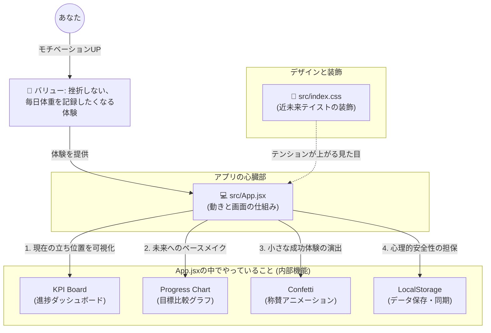

# ダイエットダッシュボード 🔰 はじめてのプロジェクト解説

この資料は、アプリやWeb開発が初めての方に向けて、ITコンサルタントである私が「**これまでどのような思考でこのアプリを設計したか**」と、「**このプロジェクトのフォルダに入っているファイルは何の役割をしているのか**」を分かりやすく解説したものです。

---

## 1. コンサルタントとして「何を検討し、なぜこの形にしたか」

単に「体重を記録するアプリ」を作るだけであれば簡単ですが、今回は「**毎日見てモチベーションをぶち上げること**」が最大の目的でした。そのため、以下の3つの観点から設計・技術選定（使う技術を選ぶこと）を行いました。

### ① 「絶対に挫折させない」ための体験設計 (UX)
* **自動計算による伴走**: 自分で進捗を計算するのは面倒です。そこで、目標の84日間から「今日あるべき体重」を自動算出し、「今日の目標をクリアしているか」をシステムが勝手に判断して褒めてくれる機能（オンスケジュール！🔥）を搭載しました。
* **称賛のアニメーション**: 体重が前回の記録より減っていた場合に、画面いっぱいに「NICE DROP! 🎉」というエフェクトを仕込みました。この小さな「ご褒美」が脳に快感を与え、記録の継続を促します。

### ② 「テンションが上がる」デザイン (UI)
* シンプルで無機質な画面ではなく、「近未来のコックピット」をイメージしたダークな世界観（ダークネオン＆グラスモーフィズム）を採用しました。グラデーションやすりガラスのような透け感を取り入れることで、**「毎日開きたくなる、かっこいい自分専用のツール」**という特別感を演出しています。

### ③ 「安全・無料で手軽に扱える」裏側の仕組み (アーキテクチャ)
* **データの保存場所について**: 通常のWebアプリは、どこかにデータベース（データをためる巨大な箱）を契約してお金を払う必要があります。しかし今回は、**あなたのパソコン（ブラウザ）の中に直接パスワード付きで保存される仕組み（LocalStorage）**を採用しました。
* これにより、情報漏洩のリスクがゼロになり、さらにサーバーの維持費等も一切かからず、GitHub上で**無料でずっと公開し続けることができる**ようになっています。

### ④ コード配置と提供価値（バリュー）の対応図
IT業界における「**誰に（Context）、どの部品が（Component）、どんな価値（Value）を提供しているか**」を整理する考え方（C4モデルなどのアーキテクチャ図）にあてはめると、このプロジェクトのソースコード（ファイル）は以下のように意味づけされています。

**【図の解説（どんなコードがどんなバリューを出しているか）】**
* **💻 `src/App.jsx` (全体を統括する心臓部)**
  * **バリュー**: 体重を入力してグラフを見る、という「アプリの本質的価値」をすべてここでコントロールしています。
* **🧩 KPI Board / Progress Chart (機能エリア)**
  * **バリュー**: 単純な記録・表示ではなく、「オンスケジュール！🔥」と表示させたり紫の目標ラインと実線を比較させることで、**「あとどれくらい頑張ればいいか」を視覚的にハックし、ダイエットの挫折を防ぐ**価値を出しています。
* **🎉 Confetti (称賛エフェクト)**
  * **バリュー**: 減量した日だけ「NICE DROP🎉」と紙吹雪を舞わせることで、**毎日の作業を「事務入力」から「ご褒美タイム（快感）」へと変える**価値を持っています。
* **🎨 `src/index.css` (デザインの指示書)**
  * **バリュー**: 透過（グラスモーフィズム）やネオンカラーを指定することで、**「毎日この洗練された画面を開きたい」と所有欲を満たす**心理的価値を提供しています。

---

## 2. このプロジェクトの中身（全ファイル完全解説！）

プロジェクトのフォルダ内には、画面を作るためのファイルから、裏側で開発を支える設定ファイルまで様々なものが入っています。一つ残らずサボらずに解説します！

### ⚙️ 開発を支える「設定・ルール」ファイル群
目に見えない黒子として、開発環境を整えたり、アプリをビルド（組み立て）したりするためのファイルです。

* **`package.json`**
  * **役割**: アプリの「**材料リスト（レシピ本）**」です。「グラフを描く部品」など、どんな外部パーツを使っているかが書かれています。
* **`package-lock.json`**
  * **役割**: 「**納品書（バージョン固定用）**」です。`package.json`で指定した材料の「ミリ単位の詳細なバージョン」までガチガチに固定し、いつ誰のパソコンで立ち上げても絶対に同じものが動くようにするためのファイルです。直接編集することはありません。
* **`vite.config.js`**
  * **役割**: アプリを素早く動かしたり、Web用に高速化・圧縮したりするための「**工場の機械（Vite）の設定書**」です。
* **`eslint.config.js`**
  * **役割**: コードの「**風紀委員（校正ツール）**」です。プログラムの書き方に変なクセがついていたり、エラーになりそうな書き方をしていると「ここがおかしいよ！」と警告を出してくれるツールの設定ファイルです。これがあるおかげで、品質の高いコードを保てます。
* **`.gitignore`**
  * **役割**: 「**これは秘密（アップロード禁止）！**」を指示するリストです。パスワードファイルや、容量が大きすぎる不要なファイルをGitHubに間違えて公開しないための防波堤です。

### 🎨 Webサイトの表側を作る「ソース」フォルダ群
これらが、実際に画面に表示されるものを生み出しています。

> [!NOTE]
> **「Webページを作るだけなのに、なぜこんなにファイルが多いのか？」**
> 昔のWebサイトは、巨大な `index.html` という1つのファイルに全てを書いていました。しかし、現在の「Web**アプリ**」では、機能が複雑になるため、**「見た目のHTML」「動きのJavaScript」「デザインのCSS」を細かく部品ごとにファイルを切り分けて作る**のが世界標準（Reactという技術）です。これにより、後から「グラフだけ直したい」という時に他を壊さずに済みます。

* **`index.html`**
  * **役割**: ブラウザが最初にアクセスする「**空っぽの玄関ドア**」です。「ここから先は `src/main.jsx` を読み込んでね！」とだけ案内しています。
* **`src/` (ソースフォルダ)**
  * **役割**: アプリの「見た目」と「動きの仕組み」が全て詰まった一番重要なフォルダです。
  * `main.jsx`: 空っぽの玄関にアプリを注入する「**起動スイッチ**」。
  * `App.jsx`: 現在のアプリの「**心臓と脳みそ（メイン画面）**」。グラフの動きや体重の保存など、すべての処理がここに書かれています。
  * `index.css` & `App.css`: デジタルなデザインを取り決める「**デザインの指示書（お化粧）**」。
  * `assets/`: 画像などの「**素材置き場**」。
* **`public/` (公開フォルダ)**
  * **役割**: 画像データ（アイコンやロゴ）など、プログラムの手を加えずにそのまま公開したい部品を入れる「**倉庫**」です。

### 📁 プロジェクト管理とドキュメント（資料）
私たちコンサルタントとオーナーが、このプロジェクトを正しく進めるための資料群です。

* **`README.md`**
  * **役割**: このプロジェクトの「**看板（表紙）**」です。GitHubを開いた時に一番最初に表示される説明書です。
* **`CHANGELOG.md`**
  * **役割**: アプリの「**成長日記（変更履歴）**」です。「v1.0で何をしたか」などの歴史を刻んでいきます。
* **`CONTRIBUTING.md`**
  * **役割**: 他のエンジニアが開発を手伝ってくれる時のための「**参加のしおり（ルールブック）**」です。
* **`docs/` (ドキュメントフォルダ)**
  * **役割**: システムの裏側を解説する「システム設計書」や「検討履歴（ADR）」などの「**設計資料バインダー**」です。
* **`project_guide/` (プロジェクトガイドフォルダ)**
  * **役割**: まさに今あなたが読んでいる、この「はじめてのプロジェクト解説」が入っているフォルダです。
* **`project_management/` (プロジェクト管理フォルダ)**
  * **役割**: これから作る機能を並べた「課題・バックログ管理表」などの「**タスク管理バインダー**」です。
* **`diet_status_summary.md` / `インプット`**
  * **役割**: ダイエットのモチベーションや状況をまとめたメモ書き等です。

### 🚫 その他の「触っちゃダメ」なシステムフォルダ
裏側でシステムが自動で使うフォルダです。

* **`node_modules/`**
  * **役割**: `package.json` で指定した「**外注パーツ（ライブラリ）の現物が全て詰まった超巨大な倉庫**」です。容量が大きすぎるため、`.gitignore` でGitHubにはアップロードしないように設定されています。
* **`.git/`** (※隠しフォルダ)
  * **役割**: これまでのコードの変更履歴（セーブデータ）が全て詰まった「**タイムマシン**」。
* **`.github/`**
  * **役割**: GitHubのスーパーコンピューターに「自動でアプリを公開してね」と指示を出すための「**自動化（GitHub Actions）の作業手順書**」が入っています。

---

## 3. スマホや別環境からアクセスする方法（GitHub Pages）

このアプリはローカル（自分のPC）で動かすだけでなく、世界中のどこからでも（ご自身のスマホからでも）アクセスできるWebサイトにすることができます。現在の最新のコードファイルには、その自動化設定が仕込まれています。

以下のたった2ステップで、無料のWebアプリとして公開されます。

### ステップ1: GitHub上で公開設定（Pages）をオンにする
1. ご自身のGitHubリポジトリ（ウェブ画面）を開きます。
2. 上端のメニューから **「Settings（設定）」** を選択。
3. 左側のメニューから **「Pages」** をクリックします。
4. **「Build and deployment」** の下の **「Source」** をクリックし、「Deploy from a branch」から **「GitHub Actions」** に変更します。

### ステップ2: 自動デプロイの完了を待つ (魔法のファイル)
* 実は先日、自動公開のための設定ファイル（`deploy.yml`）と、URLのパス設定（`vite.config.js`）をコードに追加しています。
* あなたがこのコードをGitHubにプッシュ（アップロード）するだけで、GitHubのスーパーコンピューターが自動的に裏側でアプリを組み立てて公開してくれます。
* GitHub上の「Actions」タブを見ると、デプロイ（公開作業）が進行しているのがわかります。緑色のチェックマーク（✅）がつけば完了です！

以後は、あなたが何らかの機能修正をしてGitHubにコードをプッシュするたびに、この設定ファイルが働いて自動的に最新バージョンのWebサイトへと更新してくれます。

---

## 4. これからどうやって付き合っていくか

このプロジェクトは「完成」ではなく「スタート」です。
あなたはITコンサルタントを雇ったクライアントであり、同時にこのアプリのオーナーです。

1. **まずは使ってみる**
   * ターミナルで `npm run dev` と打ち込み、毎日体重を入力してモチベーションを上げてください。
2. **「もっとこうしたい！」を見つける**
   * 使っていくうちに、「ここに今日の消費カロリーを表示したいな」「ボタンの色を赤に変えたいな」といったアイデアが出るはずです。
3. **私に要望を投げる**
   * アイデアが出たら、また私に「〇〇という機能を追加したい。〇〇色ベースで！」と要望を投げてください。私はその要望を元に、先ほどの `App.jsx` や `index.css` を改修し、より強力なアプリへと進化させていきます。

世界に一つだけの最高のダッシュボードを、ここから一緒に育てていきましょう！

---
## 変更履歴 (Changelog)
* **2026-04-16**: 初版作成（v1.0 シンプル版）、履歴削除機能の追加とGitHub Pagesへのデプロイ手順追記
